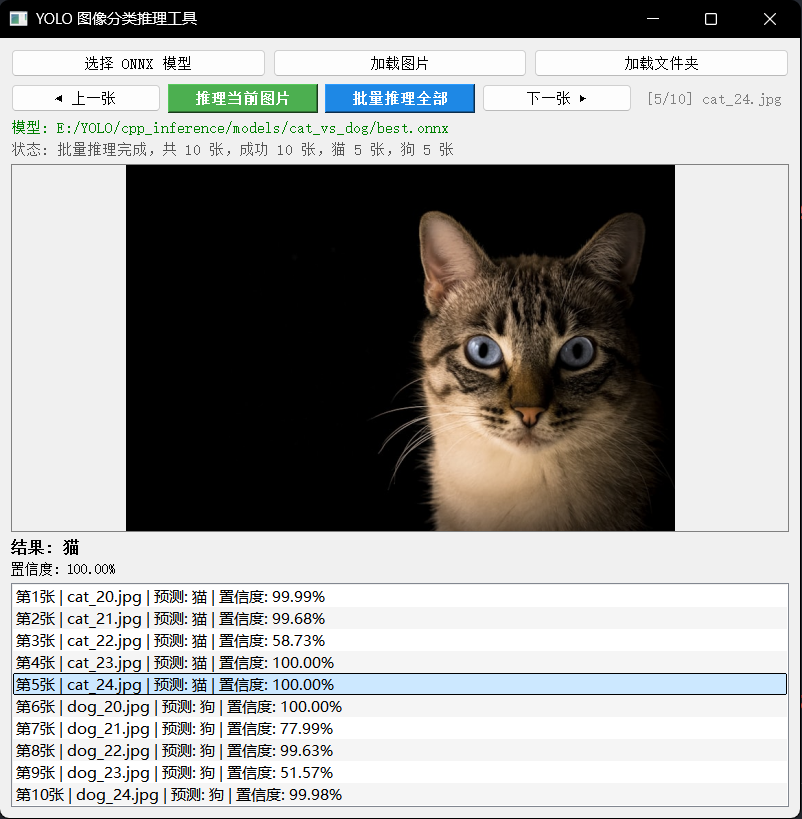
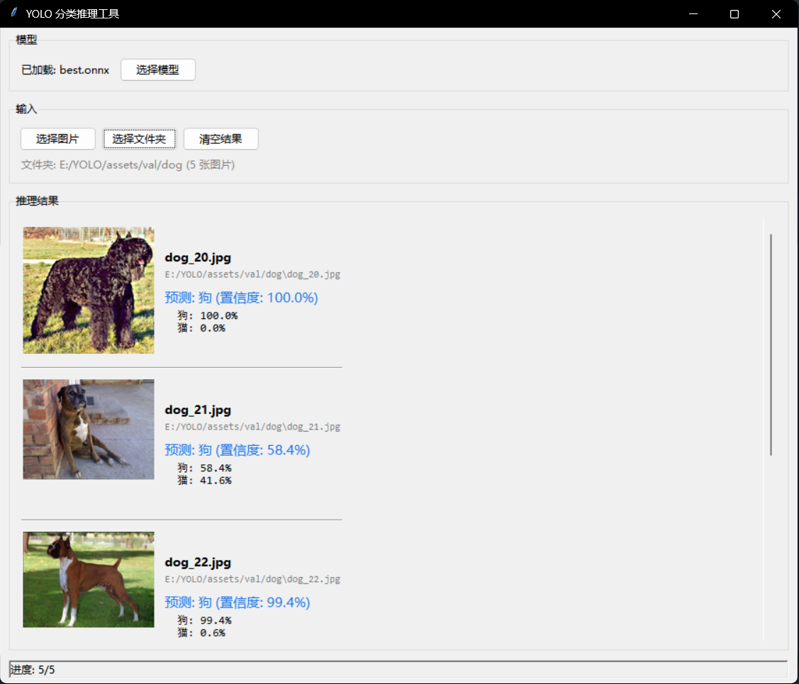

# YOLO 图像分类推理工具 (C++ / Qt5 / OpenCV / ONNX Runtime)

基于 ONNX Runtime 的跨平台图像分类推理程序 Demo，使用 Qt5 构建图形界面，并通过 OpenCV 统一图片解码与预处理。

当前界面支持：

- 选择 ONNX 分类模型
- 加载单张图片并推理
- 选择文件夹后递归扫描所有子文件夹中的图片
- 一次性批量推理当前列表中的全部图片
- 结果列表点击回看，并显示 `cat -> 猫`、`dog -> 狗` 的中文映射

## 界面展示

### C++ 推理界面



### Python 推理结果



## 架构

```txt
cpp_inference/
├── CMakeLists.txt          # CMake 构建配置
├── main.cpp                # 程序入口
├── MainWindow.h            # 主窗口 UI 声明
├── MainWindow.cpp          # 主窗口 UI 实现
├── OnnxClassifier.h        # ONNX 分类器接口声明
└── OnnxClassifier.cpp      # ONNX 分类器推理实现
```

### 模块职责

| 模块 | 职责 |
|------|------|
| `OnnxClassifier` | 封装 ONNX Runtime，负责模型加载、基于 OpenCV 的图像预处理、推理执行 |
| `MainWindow` | Qt 图形界面，负责用户交互、图片显示、单张/批量结果展示 |
| `ImageUtils` | 使用 OpenCV 统一图片解码，并在 OpenCV / Qt 之间转换图像格式 |
| `main.cpp` | 程序入口，初始化 QApplication |

### 推理流程

```txt
用户选择图片 → MainWindow::classify()
                  ↓
            OpenCV 解码原图
                  ↓
            preprocess() → 短边缩放到输入尺寸 → 中心裁剪到输入尺寸 → RGB转换 → /255
                  ↓
            Ort::Session::Run() → ONNX 推理
                  ↓
            解析输出 → 返回 Result{类别, 置信度}
                  ↓
            displayResult() → 更新 UI 显示
```

## 环境要求

| 依赖 | 版本 | 说明 |
|------|------|------|
| CMake | ≥ 3.16 | 构建系统 |
| Qt5 | 5.12+ | GUI 框架 |
| OpenCV | 4.x | 图像解码、缩放、裁剪 |
| ONNX Runtime | 1.23+ | 推理引擎 |
| 编译器 | MSVC / Clang / GCC | C++17 支持 |

## 构建

```bash
# 配置（Ninja 生成器）
cmake -S . -B build -G Ninja -DCMAKE_PREFIX_PATH="$env:QTDIR"

# 编译
cmake --build build
```

## CI

仓库已提供一套覆盖 **C++ / Qt / OpenCV / ONNX Runtime** 的 GitHub Actions 流水线：

- Windows：Qt `5.12.12` + MSVC + CMake/Ninja 构建
- Linux：Qt `5.12.12` + GCC + CMake/Ninja 构建
- Python 训练相关流程当前不进入 CI

触发规则：

- 推送到 `master` / `main` 会自动执行 C++ 构建
- Pull Request 到 `master` / `main` 会自动执行检查
- 推送 `v*` 标签时，会额外生成 Windows 发布包并上传到 GitHub Release

发布包内容：

- `YOLOClassifier.exe`
- `windeployqt` 部署后的 Qt 运行库
- `onnxruntime*.dll`
- `abseil_dll.dll`
- `re2.dll`
- `libprotobuf-lite.dll`
- `libprotobuf.dll`
- `README.md`
- 示例模型 `models/cat_vs_dog/best.onnx`

对应 workflow 文件：

- `.github/workflows/cpp-cmake-ci.yml`

## 使用

1. 运行程序
2. 点击 **选择 ONNX 模型** → 选择训练导出的 `.onnx` 文件
3. 单张模式：
   点击 **加载图片** → 点击 **推理当前图片**
4. 批量模式：
   点击 **加载文件夹** → 程序会递归收集子文件夹中的图片 → 点击 **批量推理全部**
5. 可点击下方结果列表中的任意项，快速切回对应图片查看结果

## 参数对齐记录（2026-04-25）

本次主要做了“Python YOLO 推理”和“C++ ORT 推理”的参数对齐，重点如下：

- 新增脚本 [`py/inspect_onnx_for_cpp.py`](./py/inspect_onnx_for_cpp.py)，可从 ONNX 读取 metadata（`task/imgsz/names/args`）并导出参数文件（如 `best.infer_params.json`）。
- C++ 侧优化了分类前处理细节（短边缩放取整、中心裁剪取整、下采样插值策略），以更接近 Ultralytics 分类默认流程。
- C++ 侧增加了 ONNX metadata 的读取与类别名解析（`names`）。

### `best.infer_params.json` 当前作用

`best.infer_params.json` 目前是**对齐/排查用报告文件**，用于查看模型导出参数并和 C++ 实现核对。  
当前 C++ 推理流程**不会自动读取**这个 JSON 文件。

`inspect_onnx_for_cpp.py` 使用示例：

```bash
# 在仓库根目录执行（以猫狗模型为例）
python py/inspect_onnx_for_cpp.py ^
  --model models/cat_vs_dog/best.onnx ^
  --image assets/val/dog/dog_21.jpg ^
  --out models/cat_vs_dog/best.infer_params.json
```

执行后会在终端打印解析结果，并写出 `models/cat_vs_dog/best.infer_params.json`。

### C++ 当前类别名查找顺序

在选择 `.onnx` 模型后，C++ 按下面顺序找类别名：

1. 模型同级目录：`labels.txt`，找不到再找 `class_names.txt`
2. ONNX metadata：读取 `names`
3. 兼容回退：若模型目录名是 `cat_vs_dog`，使用 `cat/dog`
4. 以上都没有时，显示 `class_N`

对应代码位置：

- [`MainWindow.cpp`](./src/MainWindow.cpp) 的 `selectModel()`
- [`OnnxClassifier.cpp`](./src/OnnxClassifier.cpp) 的 `loadModel()` 与 `modelClassNames()`

### 对猫狗模型和试剂模型的建议

两个模型都建议各自放在独立目录，并在模型目录至少提供以下文件之一：

- `labels.txt`（推荐）
- 或依赖 ONNX metadata 的 `names`

这样 C++ 在切换猫狗模型/试剂模型时会自动加载对应类别名，避免串类。

## 模型来源

模型由 [`py`](./py/) 目录中的 Python 脚本基于 YOLO 训练的分类模型导出，训练脚本示例：

### 系统硬件

| 组件 | 规格 |
|------|------|
| CPU | Intel Core i7-13700H (14核20线程) |
| GPU | NVIDIA GeForce RTX 4060 Laptop GPU |
| VRAM | 8 GB |
| 内存 | 32 GB DDR5 5600MHz (16GB x2) |
| CUDA | 12.6 |

### 软件环境

| 工具 | 版本 |
|------|------|
| Python | 3.11.5 |
| PyTorch | 2.8.0+cu126 |
| Ultralytics | 8.4.33 |
| 平台 | Windows 11 |

导出的 `.onnx` 文件即为推理程序所需的模型文件。

## 预处理说明

当前 `cpp_inference` 调用这份 Ultralytics 导出的分类 ONNX 之前，按下面的顺序做预处理：

```txt
1. 用 OpenCV 解码原图
2. 按比例缩放，使“短边”刚好等于模型输入尺寸
3. 从缩放后的图像中心裁出 HxW（本项目里是 224x224）
4. 转成 RGB
5. 将像素从 0~255 转成 0~1 的 float
6. 按 NCHW 布局喂给 ONNX Runtime
```

也就是：

```txt
原图 -> Resize(shorter_side = 224) -> CenterCrop(224x224) -> RGB -> float / 255 -> NCHW
```

这里有两个容易出错的点：

1. 不能用“缩进 224x224 框内”的做法替代 `Resize(shorter_side=224)`，否则会保留黑边或直接改变主体比例。
2. 这份 ONNX 在当前工程里不再额外做 ImageNet `mean/std` 标准化；如果继续做 `(x - mean) / std`，验证集结果会明显偏掉。

输入布局为 **NCHW** `[1, 3, 224, 224]`，输出为各类别概率，例如本项目是 `[cat, dog]`。

## 与 Python 结果的差异说明

当前版本的目标是让 **预测类别** 与 Python 侧测试结果保持一致，并把置信度差异尽量收敛。

需要先明确一点：当前仓库中的 [`py/predict_gui.py`](./py/predict_gui.py) 并不是“手写 OpenCV + ONNX Runtime”的对照脚本，而是通过 Ultralytics 的 `YOLO(...)` 封装来加载模型并执行推理。

这意味着：

- C++ 侧是当前工程自己实现的 `OpenCV 解码 + 预处理 + ONNX Runtime 推理`
- Python 侧是 `Ultralytics 封装 + 其内部推理流程`

即使 Python 最终对 `.onnx` 也可能落到 ONNX Runtime 后端，前处理、批处理组织、结果封装和显示逻辑仍然不一定与当前 C++ 代码完全一致。

在这个前提下，C++ / Qt / ONNX Runtime 的推理结果可能会出现下面这种情况：

- 最终类别一致
- 置信度数值与 Python 脚本不是完全相同

这在当前阶段是正常现象，主要原因通常不是模型变了，而是两边的推理链路没有做到 **完全同一实现**。常见差异来源包括：

1. Python 脚本不是直接调用你自己写的 `onnxruntime.InferenceSession(...)`，而是走 Ultralytics 的模型封装
2. 图像解码库不同：Python 侧通常使用 PIL / OpenCV，旧版 C++ 侧使用 Qt 的 `QImageReader`
3. 缩放插值实现不同：即使都是双线性插值，不同库的边界和取整策略也可能不同
4. 中心裁剪取整细节不同：奇偶尺寸下，中心点可能相差 1 个像素
5. EXIF、颜色通道读取、内部像素格式处理存在实现差异
6. 输出结果的封装方式不同：Python 侧展示的是 Ultralytics `result.probs.top1conf`，C++ 侧直接读取模型输出 tensor

当前仓库已经改为在 C++ 侧使用 OpenCV 统一图片解码、缩放和裁剪，这会明显缩小和 Python 常见 OpenCV 链路之间的差异。

如果这份分类 ONNX 本身已经输出概率分布，那么 C++ 直接读取输出 tensor 是合理的；但如果你想做“严格对齐”，仍然不能只拿 `predict_gui.py` 的显示结果来判断，需要让 Python 侧也改成同一套 `OpenCV + ONNX Runtime` 推理流程后再比较。

因此，当前项目对“结果正常”的判定标准是：

- 批量数据集上的类别判断正确
- 整体趋势与 Python 推理一致

而不是要求每一张图的概率值都和 Python 完全相等。

如果后续需要把置信度进一步对齐到非常接近 Python，推荐做法是：

1. Python 侧单独写一个 `OpenCV + ONNX Runtime` 的最小推理脚本
2. Python 导出同一张图片的预处理后输入 tensor
3. C++ 导出同一张图片的预处理后输入 tensor
4. 对两边 tensor 做逐元素比对，再继续调整缩放、裁剪和读图细节

## 扩展

- 修改类别：在 `MainWindow::selectModel()` 中修改 `setClassNames()` 参数
- 修改输入尺寸：同步修改 `OnnxClassifier::preprocess()` 的缩放尺寸和 Tensor 形状
- 批量推理：遍历图片列表，重复调用 `classify()`
